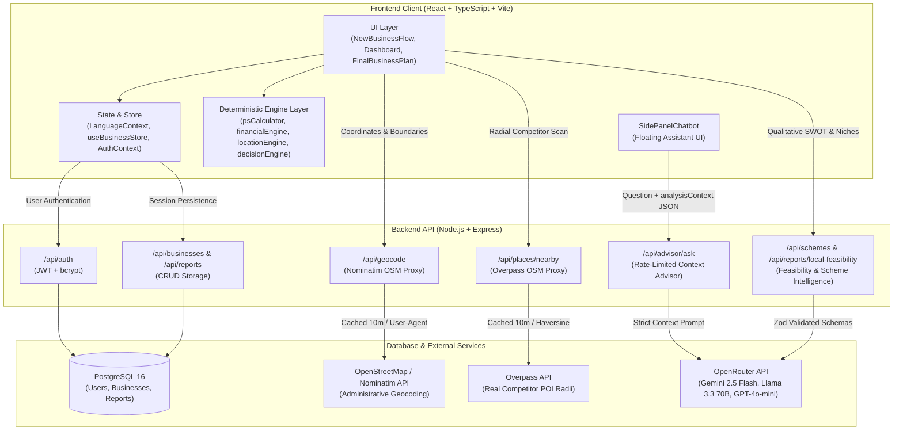

# PRAVIRAK

> AI-assisted business decision and institutional loan appraisal platform for rural and semi-urban micro-entrepreneurs in India — "Ideas to Livelihoods."

- **Live Demo**: [https://pravirak.vercel.app/](https://pravirak.vercel.app/)
- **Demo Video**: [https://youtu.be/U_xU9XizJfc](https://youtu.be/U_xU9XizJfc)
- **Problem Statement**: SIH26091
- **Team**: SOCRATIX

---

## Problem and Solution

First-generation and rural micro-entrepreneurs in India face severe information asymmetry when evaluating new business ventures, often relying on guesswork or predatory informal lenders. They lack objective tools to evaluate local competitor density, residential catchment footfall, required margin capital, and eligibility under central/state subsidized credit schemes. 

PRAVIRAK solves this by coupling server-side geospatial intelligence (OpenStreetMap and Overpass API) with 100% deterministic financial and amortization engines to deliver evidence-backed START / MOVE / ADJUST viability decisions. The platform computes required margin capital, automatically routes projects to Micro Finance or Term Loan schemes, generates statutory quarterly amortization schedules with moratorium periods, and explains results in English, Hindi, and Telugu without hallucinating financial figures.

---

## Core Features with Evidence

### 1. New Analysis & Live Capital Sizing Flow
Guides first-generation entrepreneurs through business selection, OpenStreetMap location search (with village/block/district parsing), and promoter margin entry. Interactively displays a live preview of the eligible scheme, project cost, and maximum loan before submission.
- **Implementation**: [`frontend/src/components/modules/NewBusinessFlow.tsx`](frontend/src/components/modules/NewBusinessFlow.tsx), [`frontend/src/engine/psCalculator.ts`](frontend/src/engine/psCalculator.ts)
- **Test File**: [`frontend/src/components/modules/NewBusinessFlow.test.tsx`](frontend/src/components/modules/NewBusinessFlow.test.tsx)

### 2. Decision Summary Card (Mobile-First 360x800)
A concise header card fitting single-screen viewport displaying the synthesis decision (START HERE / MOVE / CHANGE / ADJUST / VALIDATE FIRST), three key numbers (project cost, loan with scheme name and rate, quarterly payment after moratorium), top 3 reasons, top 3 risks, and one clear "Do this first" launch action.
- **Implementation**: [`frontend/src/components/modules/FinalBusinessPlan.tsx`](frontend/src/components/modules/FinalBusinessPlan.tsx) (lines 325-420), [`frontend/src/engine/decisionEngine.ts`](frontend/src/engine/decisionEngine.ts)
- **Test File**: [`frontend/src/components/modules/FinalBusinessPlan.test.tsx`](frontend/src/components/modules/FinalBusinessPlan.test.tsx), [`frontend/src/components/modules/Deduplication.test.tsx`](frontend/src/components/modules/Deduplication.test.tsx)

### 3. Interactive Spatial Catchment & Competitor Map
Interactive Leaflet map illustrating the business location alongside 5 km Micro-Catchment and 10 km Macro-Catchment radial boundary circles, competitor markers queried from OpenStreetMap via Overpass API, and nearby transit and residential hubs.
- **Implementation**: [`frontend/src/components/modules/MarketMap.tsx`](frontend/src/components/modules/MarketMap.tsx), [`backend/src/services/placesService.js`](backend/src/services/placesService.js)
- **Test File**: [`backend/src/services/placesService.test.js`](backend/src/services/placesService.test.js), [`frontend/src/engine/locationAnalysisEngine.test.ts`](frontend/src/engine/locationAnalysisEngine.test.ts)

### 4. Deterministic Scheme Loan Breakdown & Quarterly Amortization
Provides statutory institutional loan sizing based on promoter margin capital ($M$) and project cost ($B$). Displays fully funded status ($M \ge 0.10 \times B$) or shortfall alerts ($M < 0.10 \times B$) with 3 actionable bridge options, complete quarterly schedule, and statutory math breakdown card.
- **Implementation**: [`frontend/src/components/common/SchemeLoanBreakdown.tsx`](frontend/src/components/common/SchemeLoanBreakdown.tsx), [`frontend/src/engine/schemeReconciliation.ts`](frontend/src/engine/schemeReconciliation.ts), [`frontend/src/engine/psCalculator.ts`](frontend/src/engine/psCalculator.ts)
- **Test File**: [`frontend/src/components/common/SchemeLoanBreakdown.test.tsx`](frontend/src/components/common/SchemeLoanBreakdown.test.tsx), [`frontend/src/engine/schemeReconciliation.test.ts`](frontend/src/engine/schemeReconciliation.test.ts), [`frontend/src/engine/psCalculator.test.ts`](frontend/src/engine/psCalculator.test.ts)

### 5. De-Duplicated Single-Home Dossier & Tabbed Analysis
Cleanly partitions content so each insight has one primary home. Analysis tabs house detailed breakdowns for Market, Opportunities, SWOT, Threats, Financials, and Schemes. The Dossier view on screen provides a "Jump to Section" navigator, while the printable document renders Short (summary + loan overview) or Full appraisals.
- **Implementation**: [`frontend/src/components/modules/FinalBusinessPlan.tsx`](frontend/src/components/modules/FinalBusinessPlan.tsx), [`frontend/src/components/modules/DecisionDashboard.tsx`](frontend/src/components/modules/DecisionDashboard.tsx), [`frontend/src/App.tsx`](frontend/src/App.tsx)
- **Test File**: [`frontend/src/components/modules/Deduplication.test.tsx`](frontend/src/components/modules/Deduplication.test.tsx)

### 6. Grounded AI Business Advisor
Persistent floating conversational assistant grounded strictly in deterministic analysis context and MSME credit guidelines. Protected by sliding-window rate limiting, character caps, and prompt-injection defenses.
- **Implementation**: [`backend/src/services/openRouterAdvisorService.js`](backend/src/services/openRouterAdvisorService.js), [`backend/src/routes/advisorRoutes.js`](backend/src/routes/advisorRoutes.js), [`frontend/src/components/chat/SidePanelChatbot.tsx`](frontend/src/components/chat/SidePanelChatbot.tsx)
- **Test File**: [`backend/src/services/advisorService.test.js`](backend/src/services/advisorService.test.js)
`

### 7. Trilingual Rural Localization (EN, HI, TE)
Full application localization across English, Hindi (हिंदी), and Telugu (తెలుగు), featuring voice-to-text input with offline-resilient error detection, unabbreviated business terms (SWOT, DSCR, EMI, Capex, Opex, PMEGP, MUDRA), and high-contrast dark/light mode styles.
- **Implementation**: [`frontend/src/data/translations.ts`](frontend/src/data/translations.ts), [`frontend/src/context/LanguageContext.tsx`](frontend/src/context/LanguageContext.tsx), [`frontend/src/components/common/VoiceInputButton.tsx`](frontend/src/components/common/VoiceInputButton.tsx)
- **Test File**: [`frontend/src/data/translations.test.ts`](frontend/src/data/translations.test.ts), [`frontend/src/components/common/VoiceInputButton.test.tsx`](frontend/src/components/common/VoiceInputButton.test.tsx)

---

## How the Numbers are Produced

PRAVIRAK strictly separates deterministic calculation from generative natural language assistance:

### 1. Deterministic Engines (Client-Side TypeScript)
All quantitative figures are produced by pure mathematical functions that never call an LLM, guaranteeing reproducibility:
- [`frontend/src/engine/psCalculator.ts`](frontend/src/engine/psCalculator.ts): Sizing project cost ($B = M / 0.10$), capping loan ($0.90 \times B$ capped at scheme limit), routing to Micro vs Term Loan, and generating the quarterly amortization table.
- [`frontend/src/engine/schemeReconciliation.ts`](frontend/src/engine/schemeReconciliation.ts): Resolves capital adequacy, calculating shortfall ($\max(0, 0.10 \times B - M)$) and formulating bridge options.
- [`frontend/src/engine/financialEngine.ts`](frontend/src/engine/financialEngine.ts): Computes capital expenditure (capex), monthly opex, monthly gross surplus, debt service coverage ratio (DSCR), break-even horizon in months, and stress tests (-15% revenue, +10% opex, +2% interest).
- [`frontend/src/engine/locationAnalysisEngine.ts`](frontend/src/engine/locationAnalysisEngine.ts): Computes spatial suitability score (0-100), competitor density per 10k residents, and footfall heuristics.
- [`frontend/src/engine/locationParser.ts`](frontend/src/engine/locationParser.ts): Normalizes administrative boundary hierarchy from geocoded place payloads.
- [`frontend/src/engine/decisionEngine.ts`](frontend/src/engine/decisionEngine.ts): Synthesizes 4 core pillars into deterministic business decisions (START HERE, MOVE TO ALTERNATIVE, CHANGE CATEGORY, ADJUST SCALE, VALIDATE FIRST).
- [`frontend/src/engine/existingBusinessEngine.ts`](frontend/src/engine/existingBusinessEngine.ts): Diagnostic engine evaluating operating health and distress for existing enterprises.

### 2. LLM Services & Strict Boundaries (Server-Side Node.js)
Generative models are accessed exclusively through OpenRouter on the backend with strict Zod validation schemas and fallback mechanisms:
- **`POST /api/advisor/ask`** ([`backend/src/services/openRouterAdvisorService.js`](backend/src/services/openRouterAdvisorService.js)):
  - **Permitted to produce**: Conversational explanations of computed facts provided in `analysisContext` JSON, procedural loan application guidance, and MSME scheme rules in English, Hindi, or Telugu.
  - **Prohibited from producing**: Inventing new rupee amounts, changing interest rates, modifying competitor counts, or recomputing financial outputs. If a figure is absent from `analysisContext`, it must state that the information is unavailable.
- **`POST /api/reports/local-feasibility`** ([`backend/src/services/localFeasibilityService.js`](backend/src/services/localFeasibilityService.js)):
  - **Permitted to produce**: Qualitative SWOT bullet points, identified demand niches, operational threat descriptions with mitigations, and pricing strategy notes validated by `localFeasibilitySchema`.
  - **Prohibited from producing**: Statutory loan caps, scheme interest rates, or capex values (which are supplied by deterministic calculations).
- **`POST /api/schemes/recommend`** ([`backend/src/services/openRouterSchemeService.js`](backend/src/services/openRouterSchemeService.js)):
  - **Permitted to produce**: Web-grounded retrieval of central/state government schemes with verifiable source names and URLs.
  - **Prohibited from producing**: Unreferenced subsidies or fabricated interest rates; discards responses lacking valid provenance.

### 3. Data Provenance & Confidence Rules
Every metric in the user interface displays an explicit provenance badge governed by code-level rules:
- **`MEASURED`**: Directly retrieved from an external API during the current active session.
  - *Code Example* ([`backend/src/services/placesService.js`](backend/src/services/placesService.js#L170-L177)): Overpass API returns live competitor POI nodes for coordinates, setting `competitorsCountProvenance = 'MEASURED'` with source `"OpenStreetMap via Overpass, queried <ISO Timestamp>"`.
- **`ESTIMATED`**: Benchmark models, heuristics, or static projections.
  - *Code Example* ([`frontend/src/engine/decisionEngine.ts`](frontend/src/engine/decisionEngine.ts#L170-L185)): Footfall projections and capex requirements derived from PRAVIRAK industry models are tagged `provenance: 'ESTIMATED'` and source `"Category benchmark (PRAVIRAK model)"`.
- **`AI_GENERATED`**: Synthesized natural language narratives and qualitative evaluations.
  - *Code Example* ([`frontend/src/engine/decisionEngine.ts`](frontend/src/engine/decisionEngine.ts#L155-L162)): Location fit commentary and qualitative SWOT insights generated via the LLM pipeline are tagged `provenance: 'AI_GENERATED'` and source `"Pravirak Spatial Intelligence Engine"`.
- **Confidence Restriction**: In [`frontend/src/components/common/EvidenceCard.tsx`](frontend/src/components/common/EvidenceCard.tsx#L40-L46), `HIGH CONFIDENCE` is programmatically barred unless `provenance === 'MEASURED'`. All estimated or AI-generated metrics are capped at `MEDIUM` or `LOW`.

---

## Architecture

### Request Flow Description
1. **Input & Geocoding**: The entrepreneur enters a business concept, village/city, and margin capital. Geocoding requests flow to `GET /api/geocode/search`, which proxies OpenStreetMap Nominatim (cached for 10 minutes) and parses administrative fields (`village`, `block`, `district`, `state`).
2. **Deterministic Processing**: Client-side TypeScript engines run instantly in the browser. `psCalculator.ts` sizes project cost and amortization schedules, `financialEngine.ts` calculates operational cashflows and DSCR, and `decisionEngine.ts` computes the synthesized feasibility decision.
3. **Geospatial POI Scanning**: The frontend queries `GET /api/places/nearby`, causing the backend to query the OpenStreetMap Overpass interpreter within a 5-10 km radius. Returned POIs are classified by sector and returned with `MEASURED` provenance.
4. **Qualitative Feasibility & Advisory**: For qualitative SWOT and pricing strategies, `POST /api/reports/local-feasibility` queries OpenRouter models and validates the payload with Zod. When chatting with the AI advisor, `POST /api/advisor/ask` passes user queries along with the verified `analysisContext` JSON under a per-IP rate limiter.
5. **Persistence**: For registered users, analyses and generated business appraisal reports are persisted to PostgreSQL via JWT-authenticated REST routes (`/api/businesses`, `/api/reports`). Guests store analyses in browser `localStorage`.

---

## Tech Stack and Open Source

### Package Licenses & Purposes

| Package Group | Package | Version | Licence | Purpose |
| :--- | :--- | :--- | :--- | :--- |
| **UI & Styling** | `react` | `^19.2.8` | MIT | Core UI component framework |
| | `react-dom` | `^19.2.8` | MIT | React DOM rendering engine |
| | `lucide-react` | `^1.45.0` | ISC | Accessible iconography |
| | `tailwindcss` | `^4.3.3` | MIT | Modern utility-first CSS engine |
| | `@tailwindcss/vite` | `^4.3.3` | MIT | Vite plugin integration for Tailwind CSS v4 |
| **Maps & Geospatial** | `leaflet` | `^1.9.4` | BSD-2-Clause | Client-side interactive mapping library |
| | `@types/leaflet` | `^1.9.22` | MIT | TypeScript definitions for Leaflet |
| | `@googlemaps/js-api-loader` | `^2.1.1` | Apache-2.0 | Optional loader for Google Maps JavaScript API |
| | `@types/google.maps` | `^3.66.2` | MIT | TypeScript definitions for Google Maps |
| **Testing** | `vitest` | `^5.0.1` | MIT | Fast unit test runner for Vite |
| | `@testing-library/react` | `^16.3.3` | MIT | React component testing utilities |
| | `@testing-library/jest-dom`| `^7.0.1` | MIT | Custom DOM element jest matchers |
| | `jsdom` | `^30.1.0` | MIT | Headless browser DOM environment for Node.js |
| **Tooling & Build** | `vite` | `^8.3.0` | MIT | Frontend build tool and development server |
| | `@vitejs/plugin-react` | `^6.1.1` | MIT | Babel/Fast Refresh plugin for React in Vite |
| | `typescript` | `~6.0.2` | Apache-2.0 | Static type system for JavaScript |
| | `oxlint` | `^1.81.0` | MIT | High-performance linter |
| | `@types/node` | `^24.13.3` | MIT | TypeScript definitions for Node.js |
| | `@types/react` | `^19.2.18` | MIT | TypeScript definitions for React |
| | `@types/react-dom` | `^19.2.7` | MIT | TypeScript definitions for React DOM |
| **Backend & Routing** | `express` | `^4.19.2` | MIT | HTTP server and REST API framework |
| | `cors` | `^2.8.5` | MIT | Cross-Origin Resource Sharing middleware |
| | `morgan` | `^1.10.0` | MIT | HTTP request logging middleware |
| | `dotenv` | `^16.4.5` | BSD-2-Clause | Environment variable loader from `.env` |
| | `zod` | `^4.6.5` | MIT | TypeScript-first schema validation with static type inference |
| **Database** | `pg` | `^8.23.0` | MIT | PostgreSQL client library and connection pooling |
| **Authentication** | `jsonwebtoken` | `^9.0.2` | MIT | JSON Web Token implementation for API authorization |
| | `bcryptjs` | `^2.4.3` | MIT | Secure password hashing algorithm |

*License Audit Verification: 100% of dependencies use permissive open-source licenses (MIT, Apache-2.0, BSD-2-Clause, ISC). Zero copyleft (GPL/AGPL) or proprietary packages are used.*

---

## Data Sources and Attribution

### 1. OpenStreetMap (OSM)
- **Attribution Text**: `"© OpenStreetMap contributors"`
- **Licence**: Open Data Commons Open Database License (ODbL) ([https://www.openstreetmap.org/copyright](https://www.openstreetmap.org/copyright)).
- **Usage**: Display of tile layers via Leaflet and spatial competitor discovery.

### 2. Overpass API
- **Endpoint**: `https://overpass-api.de/api/interpreter`
- **Usage**: Server-side competitor querying within 5-10 km radius, mapping categories to OSM amenity, shop, and craft tags. Enforces a 10-second timeout and 10-minute in-memory cache.

### 3. OpenStreetMap Nominatim
- **Endpoints**: `https://nominatim.openstreetmap.org/search`, `https://nominatim.openstreetmap.org/reverse`
- **Usage Policy Compliance**:
  - Custom identifying User-Agent: `PRAVIRAK-BusinessAdvisor/1.0 (contact: support@pravirak.app)`
  - Maximum rate: Enforces single-thread request throttling and a 10-minute server cache (`cache.set(cacheKey, ...)`).
  - Target filtering: Constrained to India (`countrycodes=in`) with 8-second request timeouts.

### 4. LLM Providers & Models Configured
- **Gateway**: OpenRouter API (`https://openrouter.ai/api/v1/chat/completions`)
- **Active Model Candidates Configured in Code**:
  - `google/gemini-2.5-flash`
  - `google/gemini-2.5-flash-lite`
  - `meta-llama/llama-3.3-70b-instruct`
  - `openai/gpt-4o-mini`
  - `nvidia/nemotron-3.5-lightning:free`
  - `openrouter/free`

### 5. Official Indian MSME Schemes Referenced in Code
All statutory parameters in [`frontend/src/data/schemes.ts`](frontend/src/data/schemes.ts) and [`frontend/src/engine/psCalculator.ts`](frontend/src/engine/psCalculator.ts) ground their criteria in official central and state programs:
- **PMEGP**: Prime Minister’s Employment Generation Programme (Khadi and Village Industries Commission - KVIC / Ministry of MSME)
- **PMMY (MUDRA)**: Pradhan Mantri MUDRA Yojana — Shishu, Kishore, and Tarun categories (MUDRA Ltd / Department of Financial Services)
- **CGTMSE**: Credit Guarantee Fund Trust for Micro and Small Enterprises (Ministry of MSME & SIDBI)
- **Stand-Up India**: Financing SC/ST and Women Entrepreneurs (SIDBI / Department of Financial Services)
- **PM Vishwakarma**: Scheme for traditional artisans and craftspersons (Ministry of MSME)
- **Udyam Registration**: Official portal integration guidelines (Ministry of MSME)

---

## Security

- **Zero Secrets in Repository**: No `.env` files or API keys are tracked in git history. All environment configurations are gitignored via `.gitignore` files in root, backend, and frontend.
- **Sliding-Window Rate Limiting**: Per-IP memory-efficient rate limiter on `POST /api/advisor/ask` capping requests at 20 calls per 10-minute rolling window.
- **Payload & Input Size Restrictions**:
  - Express body parser capped at 2MB (`express.json({ limit: '2mb' })`).
  - Advisor questions capped at 500 characters max length.
  - Geocoding and places endpoints validate numerical float types on latitude and longitude before querying upstream APIs.
- **Prompt Injection Defense**:
  - [`backend/src/services/openRouterAdvisorService.js`](backend/src/services/openRouterAdvisorService.js) enforces strict system prompt isolation.
  - Any prompt injection attempt (e.g. asking to ignore instructions, role-play, or reveal credentials) triggers an immediate fallback response: *"I can only help with business and financing questions for your plan."*
  - Tested and verified in [`backend/src/services/advisorService.test.js`](backend/src/services/advisorService.test.js).
